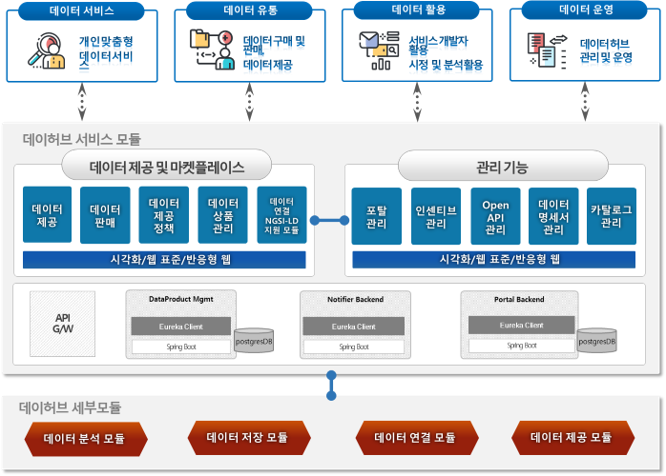

# 1. 데이터허브서비스 모듈개요

Data Marketplace Module of City Data Hub

This is an open API of Data Service Module. The data service module API is a module suitable for the service that commercializes and distributes data from the data hub. You can find out more about City Data Hub at http://citydatahub.kr/

</br>



</br>

## 1.1. 프로젝트 구성

```
* frontend (egovframework)
	1. datahub-dataservice-userportal
		=> 데이터 마켓플레이스 모듈 (이용 및 제공자 전용)
	2. datahub-dataservice-adminportal
		=> 데이터 마켓플레이스 모듈 (운영 및 관리 전용)

* backend (spring boot)
	1. datahub-dataservice-portal
		=> 포탈 API 모듈
	2. datahub-dataservice-notifier
		=> 실시간 전송 모듈 (지원프로토콜 : HTTP, MQTT, Websocket)
	3.  datahub-dataservice-dataset-provider
		=> 데이터셋 관련 API 모듈
```

## 1.2. 기본포트 및 사용버전

```
* 기본 포트
	datahub-dataservice-portal (::7910)
	datahub-dataservice-notifier (::7940)
	datahub-dataservice-dataset-provider (::7930)

* 사용 버전
	JAVA          -> 1.8
	PostgreSQL    -> 10.10
	Spring Boot   -> 2.0.5.RELEASE
	Egovframework -> 3.8.0
	Apache Maven  -> 3.6.3

```
