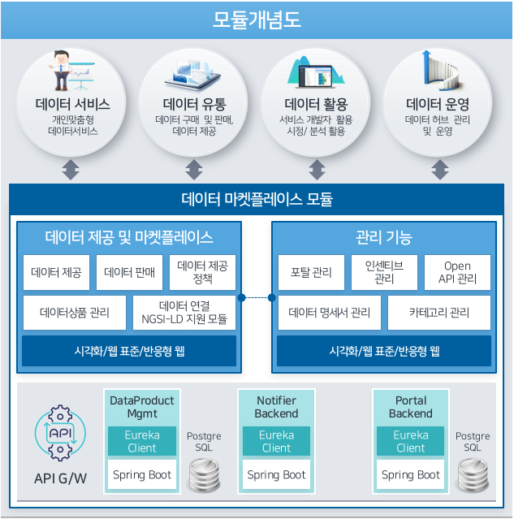
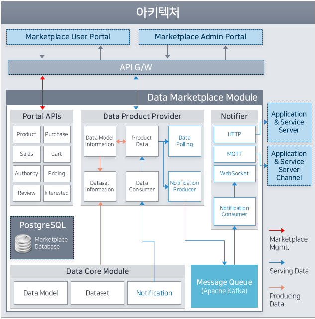

# 1. 데이터 마켓플레이스 모듈 개요

데이터 마켓플레이스 모듈은 City Data Hub에 저장된 데이터를 유통하여 스마트시티 서비스에 활용하기 위한 데이터 마켓플레이스 포털을 제공합니다. 데이터 코어 모듈과의 연동을 통해 과거 이력 또는 지속적으로 수집되는 데이터를 데이터 판매자 및 구매자 간에 유통할 수 있습니다.

</br>

## 모듈 개념도


</br>

## 모듈 아키텍처


</br>

## 1.1. 프로젝트 구성

```
* frontend (egovframework)
	1. datahub-dataservice-userportal
		=> 데이터 마켓플레이스 모듈 (이용 및 제공자 전용)
	2. datahub-dataservice-adminportal
		=> 데이터 마켓플레이스 모듈 (운영 및 관리 전용)

* backend (spring boot)
	1. datahub-dataservice-portal
		=> 포탈 API 모듈
	2. datahub-dataservice-notifier
		=> 실시간 전송 모듈 (지원프로토콜 : HTTP, MQTT, Websocket)
	3.  datahub-dataservice-dataset-provider
		=> 데이터셋 관련 API 모듈
```

## 1.2. 기본포트 및 사용버전

```
* 기본 포트
	datahub-dataservice-portal (::7910)
	datahub-dataservice-notifier (::7940)
	datahub-dataservice-dataset-provider (::7930)

* 사용 버전
	JAVA          -> 1.8
	PostgreSQL    -> 10.10
	Spring Boot   -> 2.0.5.RELEASE
	Egovframework -> 3.8.0
	Apache Maven  -> 3.6.3

```
