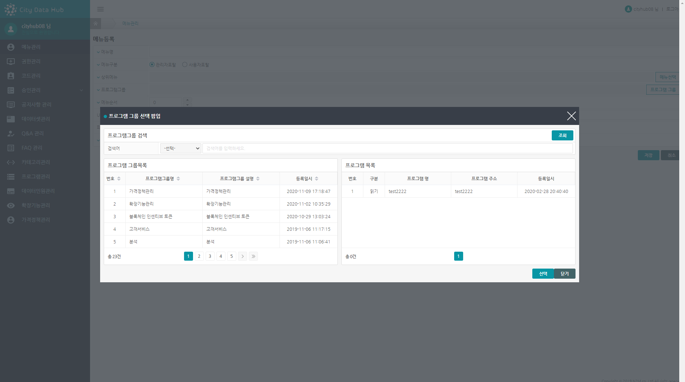
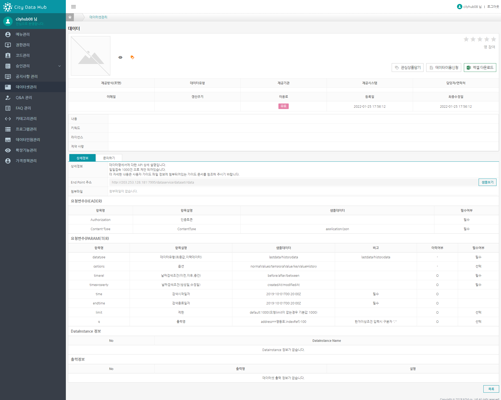
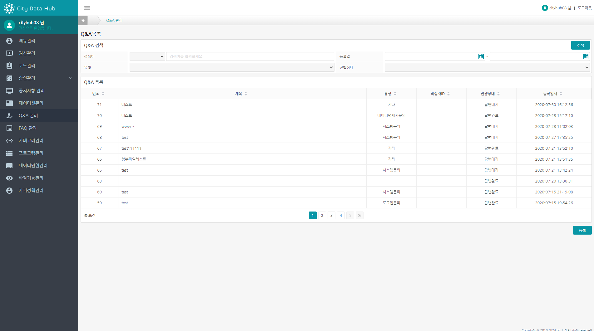
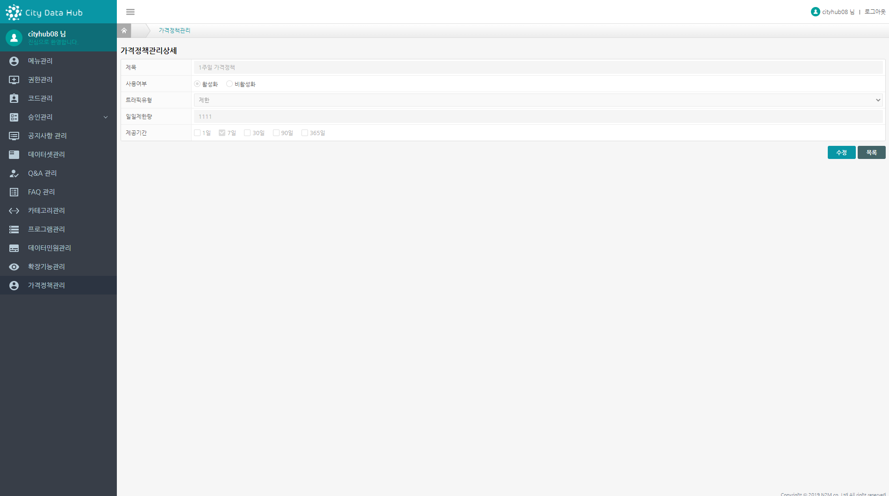

# 1.로그인

데이터 마켓플레이스 모듈의 관리영역 로그인 화면입니다.

관리자 접속 계정은 통합인증인가 서버에서 발급 받은 계정이어야 합니다.

 

 

# 2.메뉴관리

데이터 마켓플레이스의 사용자, 운영자 포탈에 대한 전체 메뉴를 관리하는 기능입니다.

 

메뉴를 선택 할 경우 이동해야 할 URI을 입력 해야 하는데 이 URI는 화면 호출 주소로 기 정의가 되어 있어야 합니다.

메뉴의 계층구조 표시가 되므로, 상위메뉴를 선택 하게 되고, 메뉴에서 사용 할 프로그램그룹을 지정하게 됩니다.

프로그램 그룹에 대한 설명은 프로그램 메뉴에서 다시 설명 하도록 하겠습니다.

 

 

최상위 메뉴로 지정 할 경우, 기본 값인 관리자메뉴 또는 사용자메뉴를  지정 해야 합니다.

관리자메뉴 또는 사용자메뉴는 성격 구분을 위한 값이며, 메뉴 상에서 노출되지 않는 값이기 때문에,

표시 대상 포탈을 선택 하면 됩니다.

 

 

프로그램 그룹을 지정 합니다.

아래 화면에서는 좌우 분할로 좌측 영역이 프로그램 그룹으로 해당 정보를 선택 하여 선택 버튼을 클릭 해 줍니다.

 

 

저장 된 메뉴의 상세 정보 화면입니다.

 

 

# 3.권한관리

권한관리는 로그인 하는 사용자별로 표시 되는 메뉴를 다르게 하여, 접근을 통제 하고자 하는 기능입니다.

권한그룹을 생성 한 뒤 사용자를 추가 하고, 이에 대한 메뉴의 접근 권한(읽기/쓰기/수정/삭제) 를 설정 합니다.

권한그룹은 데이터마켓플레이스의 사용자/관리자 포탈을 구분하여 생성 하게 됩니다.

 

 

관리자, 사용자 포탈을 구분하여 저장합니다.

 

 

권한그룹이 관리자로 되어 있는 경우에는,  사용자 및 메뉴는 관리자 기준으로 정보가 표시 됩니다.

# 4.코드관리

코드그룹은 프로그램 개발 시 참조 하는 값으로, 코드그룹 및 하위 코드들로 구성됩니다.

키, 값 형태로 키는 프로그램 개발 시 참조 되는 값이고, 값은 화면에 표시 되는 값입니다.

화면상에 표시 되는 특정 Label 및 selectbox 등 문구를 변경 하고자 할 경우, 관리 되고 있는 코드의 값만 변경 하면 화면에도 자동으로 문구가 변경 할 수 있습니다.

 

관리 할 코드그룹을 우선 생성을 한 뒤, 상세화면으로 들어가 하위 코드를 추가 해야 합니다.

 

 

코드그룹 상세화면입니다.

코드그룹 상세화면에서는 우측 하단의 등록 버튼을 선택 하여 하위 코드를 추가 할 수 있습니다.

 

 

코드 등록 팝업입니다.

코드 정보 입력 후 저장버튼을 선택하여 코드를 추가 합니다.

 

 

# 5.승인관리

데이터 마켓플레이스 - 사용자 포탈 이용자는 데이터셋 및 분석가 요청 정보를 등록 하게 되면, 승인을 받아야 하는데, 이 곳에 승인 요청 대기 정보가 표시 됩니다.

승인/반려 처리가 되면 요청 대기목록에서는 정보가 사라집니다.

 

## 5.1.데이터셋요청

데이터 마켓플레이스 - 사용자 포탈에서 등록 한 데이터셋 목록입니다.

승인처리자는 데이터셋의 정보를 확인 하고 이상유무를 판단, 승인/반려 처리를 진행합니다.

 

 

## 5.2.분석가요청

데이터 마켓플레이스 - 사용자 포탈에서 등록 한 분석가요청 목록입니다.

상세 화면으로 이동 하여 정보 확인 후 승인을 진행합니다.

 

 

# 6.공지사항관리

공지사항 등록 시 데이터 마켓플레이스 사용자이용 포탈의 공지사항에 표시됩니다.

공지사항은 우선공지를 선택하게 되면, 날짜 상관없이 최 상단에 표시가 되고,

팝업 체크를 할 경우에는, 데이터 마켓플레이스 사용자 이용 포탈 메인진입 시, 공지사항 내용이 팝업으로 표시 됩니다.

 

 

# 7.데이터셋관리

데이터 마켓플레이스 사용자 이용 포탈에서의 데이터셋과 동일합니다.

이 곳에 존재 하는 이유는, 데이터를 제공하는 제공자의 대리 등록을 하기 위함이며,

데이터셋 등록 시 제공자를 지정 해야 합니다.

 

 

# 8.Q&A관리

데이터 마켓 플레이스 - 사용자 이용 포탈에서 등록 된 질문정보가 표시 되며,

상세 화면으로 전환하여 질문에 답변을 작성 할 수 있습니다.

답변을 하기 전 최초 질문상태에서는 질문자가 정보를 삭제 할 수 있습니다.

 

 

# 9.FAQ관리

자주 하는 질문에 대한 답변을 정의 해 놓은 곳입니다.

 

 

# 10.카테고리관리

카테고리 정보를 계층구조 형태로 등록 관리하는 곳입니다.

등록 된 카테고리는 데이터셋 등록 시 카테고리를 지정 하게 됩니다.

 

 

# 11.프로그램관리

개발 시 정의 됐던 프로그램 API 의 URI 를 프로그램 단위로 정의 해 놓고, 이를 그룹화하여 관리하는 곳입니다.

프로그램그룹은 메뉴관리에 연결이 되며, 메뉴는 권한관리의 접근메뉴에 연결이 됩니다.

프로그램 관리를 하는 목적은,  사용자별 메뉴 접근권한을 설정 하기 위함인데,

읽기/쓰기/수정/삭제를 구분하기 위해서는 프로그램 단위인 API URI 정의를 해야 합니다.

즉,  프로그램의 URI 는 읽기or쓰기or수정or삭제 라고 정의를 하여, 메뉴를 통해 진입 한 화면이 읽기/쓰기/수정/삭제 인지를 판단해 접근은 제어 하는 형태입니다.

 

먼저 프로그램그룹을 생성 한 뒤, 상세화면으로 전환하여 프로그램을 추가 합니다.

화면 구조는 코드관리와 비슷합니다.

 

 

# 12.데이터민원관리

데이터 마켓 플레이스 - 사용자 이용 포탈에서 신고하기 기능으로 등록 된 정보가 이 곳에 표시됩니다.

Q&A 처럼 질문 답변 형태이므로, 신고하기에 대한 질문에 대한 답변을 등록 해야 합니다.

답변은 상세화면으로 전환 한 뒤, 작성 할 수 있습니다.

 

 

# 13.확장기능관리

확장 기능에 대한 on / off 설정 화면이며, 현재는 데이터셋의 유료화 확장 기능만 지원합니다.

데이터셋의 유료화 확장 기능을 비활성화 할 경우에, 데이터 셋의 유료 관련 기능은 모두 비 활성화 되어 사용이 불가합니다.

 

 

# 14.가격정책관리

데이터셋 유료 전환 시에 사용 되는 가격정책 정보입니다.

기본으로 운영포탈에 접근하는 운영자는 다양한 형태의 가격정책을 정의 합니다.

데이터 마켓 플레이스 에서 데이터를 제공 하는 제공자는 유료 전환 시, 이 곳에서 설정 된 가격정책 전체 정보 목록 중 단일 또는 복수개를 설정 합니다.

즉, 최초 가격정책은 운영담당자가 정의하고, 데이터셋 유료전환 시 사용 할 가격 정책은 제공자가 선택 합니다.

