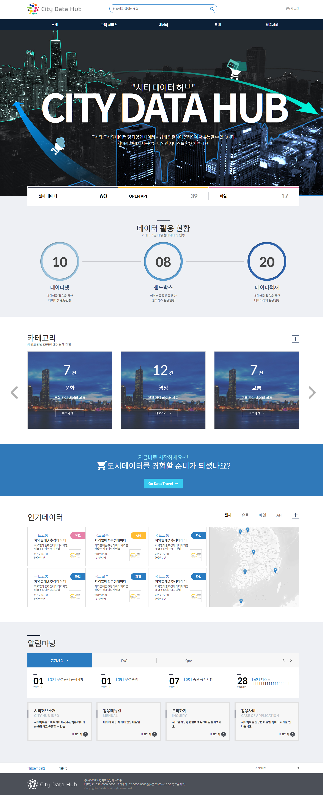

데이터 마켓플레이스 모듈 최초 진입시 보여지는 메인화면이며, 다음과 같은 구성으로 데이터를 표현하고 있습니다.

* 로그인
* 데이터셋의 유형별 통계 수치
* 카테고리별 데이터셋 수치
* 인기데이터 현황
* 알림마당
* 통합데이터 검색

------

전체 메뉴 구성은 다음과 같습니다.

* 고객서비스
  * 신고하기
  * 묻고 답하기
  * 공지사항
  * FAQ
* 데이터
  * 데이터셋
* 통계
  * 카테고리별 데이터셋 현황
  * 지도 기반 데이터셋 데이터 현황
* 활용사례
  * 활용후기
* 마이페이지 (로그인 이후 활성화)
  * 데이터활용
    * 관심데이터
    * 데이터 이용내역
    * 데이터 분석가요청
    * 데이터 판매내역
    * 인센티브 토큰 발급 내역
    * 데이터 환불 내역
  * 데이터제공
    * 데이터관리
    * 데이터 사용자현황
    * 어댑터 신청 내역
    * 데이터 환불 내역

 

------

