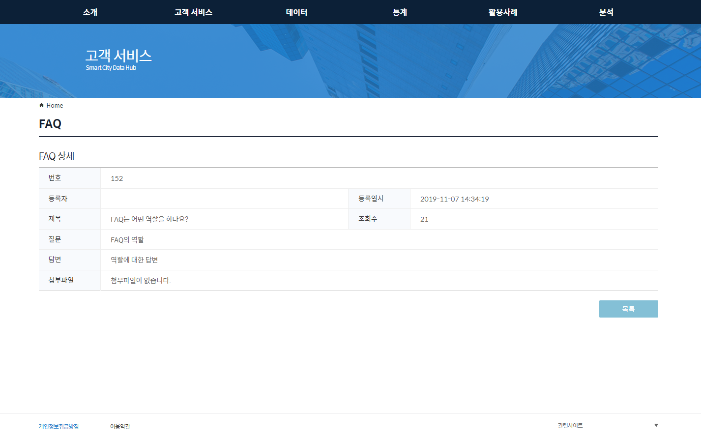

# 3.고객서비스

고객서비스는 다음과 같은 하위 메뉴를 포함 합니다.

* 신고하기
* 묻고답하기
* 공지사항
* FAQ

------

### 1. 신고하기

데이터 마켓플레이스 모듈을 이용 하면서 생기는 시스템 및 장애, 컨텐츠등 여러 이슈들에 대한 의견을 등록하는 곳입니다. Q&A처럼 질문을 등록 하면, 운영 담당자는 이를 확인 하여 답변을 하는 공간입니다.

아래는 등록 된 신고하기 목록 정보가 표시 되며, 검색조건을 통해 데이터를 재 조회 합니다. 

신규 등록 시에는 하단 등록 버튼을 통해 등록 페이지로 전환 할 수 있습니다.

그리드 목록의 단일 ROW 선택 시에는 상세 정보 화면으로 전환 됩니다.

신고하기 등록 화면 영역입니다. Label 앞의 (*) 붉은표시는 필수 값을 의미합니다.

정보 입력 후 저장 버튼 선택 시 데이터가 저장 됩니다.

목록화면 버튼 클릭 시에는 위의 목록 화면으로 이동 합니다.

데이터 그리드 목록의 단일 ROW 선택 시에 전환 된 상세 화면입니다.

첨부파일이 있는 경우 파일을 선택 하여 다운로드를 받을 수 있습니다.

목록버튼 선택 시 목록 화면으로 이동 됩니다.

### 2. 묻고답하기

일반적인 질문과 답변을 하는 공간입니다.

우측 하단 등록 버튼을 통해 질문을 등록 할 수 있습니다.

질문을 등록 하는 화면입니다.

등록 된 질문의 상세 화면입니다.

최초 질문 등록 시에는 질문대기 상태가 되며, 운영담당자가 해당 글에 답변들 할 경우, 답변완료 상태로 전환됩니다.

### 3. 공지사항

데이터허브 운영자 포탈에서 등록 된 공지사항이 이곳에 표시 됩니다.

사용자는 공지사항을 등록 할 수 없기 때문에, 등록 버튼은 별도로 존재 하지 않습니다.

공지사항 상세 화면입니다.

### 4. FAQ

자주 하는 질문 유형을 선별하여 답변을 해 놓은 곳입니다.

FAQ상세화면입니다.

