# 4.데이터

데이터 공개 목적의 데이터셋을 작성하여 오픈 하는 공간입니다.

데이터를 공개(무료,유료) 하고자 하는 제공자는 데이터셋을 최초 생성 할 경우에, 관리 주체(승인 처리자) 로 부터 승인을 받아야만 이 곳에 오픈이 됩니다.

오픈 된 데이터셋을 이용하고자 하는 사용자는, 해당 데이터셋을 이용신청 하여, 데이터를 API 요청 형태 또는 실시간 수신 형태로 정보를 받을 수 있습니다.

------

 

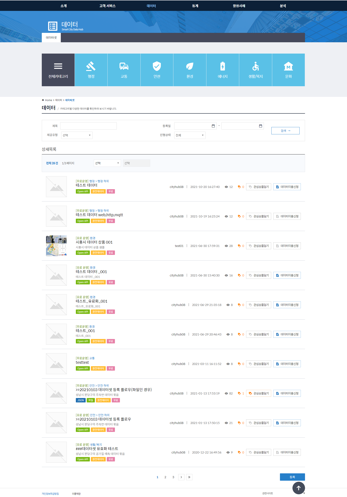

 

 

데이터셋의 상세 정보 화면입니다.

Endpint 주소는 사용자가 이용신청 시 호출 할 대상 API 주소로, 해당 데이터셋에 정의한 데이터를 반환하게 됩니다.

 

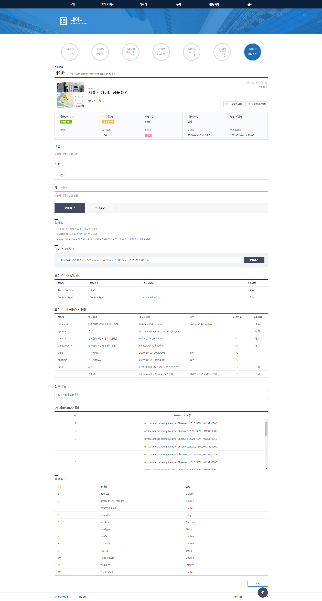

 

 

데이터셋의 상세 정보 화면에서 상세 정보 및 문의하기가 탭으로 구성 되어 있는데, 문의하기 탭을 눌렀을 때의 화면입니다.

사용자는 제공자가 작성 한 데이터셋에 대해 궁금한 부분이 있는 경우 직접 문의하기 글을 등록하고, 답변을 받을 수 있습니다.

 

 

 

데이터셋의 등록 화면의 초기 상태 입니다.

데이터셋은 사용자 입장이 아닌, 데이터를 제 3자에게 제공 하는 제공자가 되어 데이터셋을 등록 해야 합니다.

기본 정보를 입력 한 뒤, 대상 데이터의 찾기 버튼을 통해 데이터 모델을 지정 해야 합니다.

 

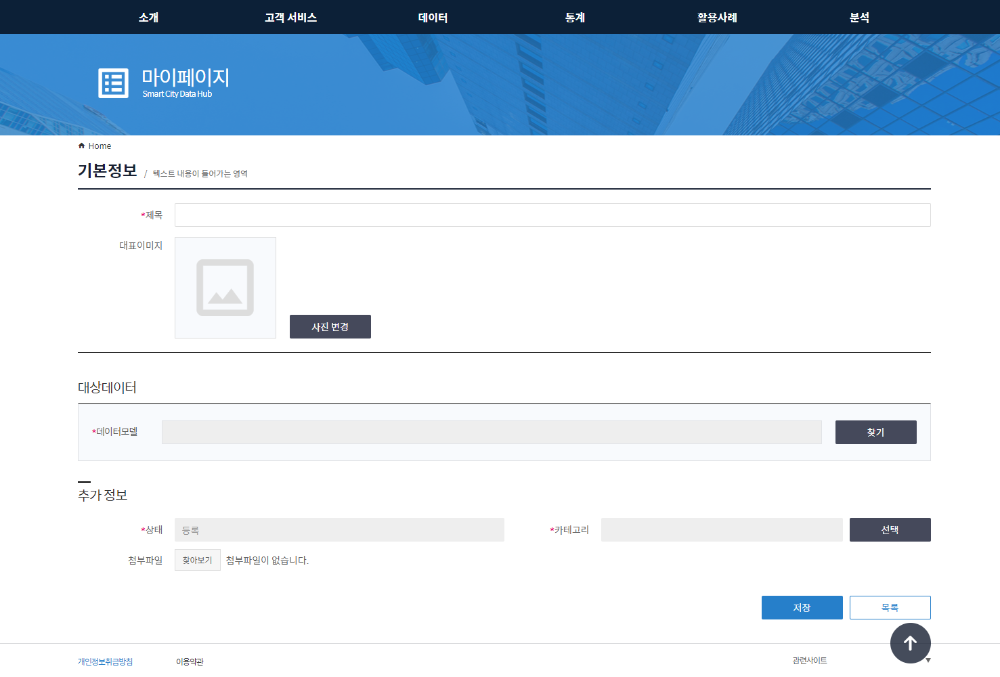

 

 

데이터모델 선택 팝업의 첫번째 단계인 데이터 모델 선택입니다.

데이터모델명, 네임스페이스, 버전 등 제공 할 대상의 모델을 선택 하고 다음으로 넘어갑니다.

 

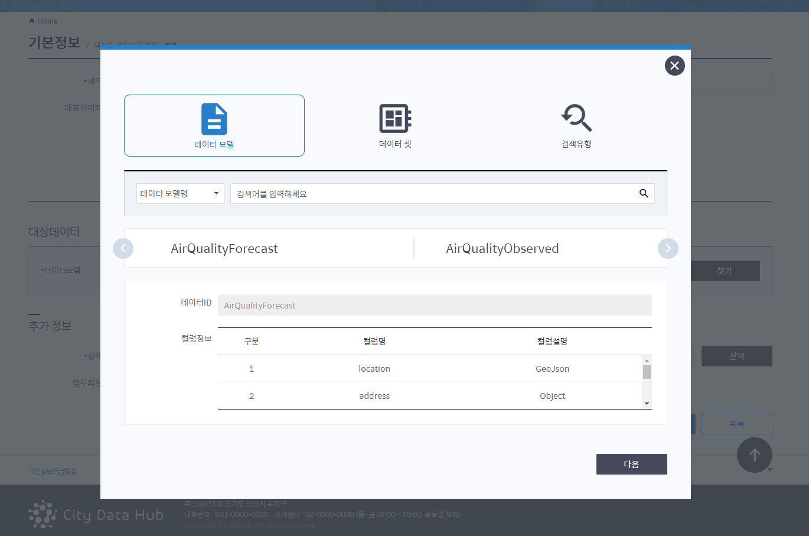

 

 

두번째 단계인 데이터셋을 선택 합니다.

앞 단계에서 선택 된 데이터모델의 하위 데이터셋 목록 정보가 표시됩니다.

데이터셋을 단일 또는 복수개 체크 하여 다음으로 넘어갑니다.

 

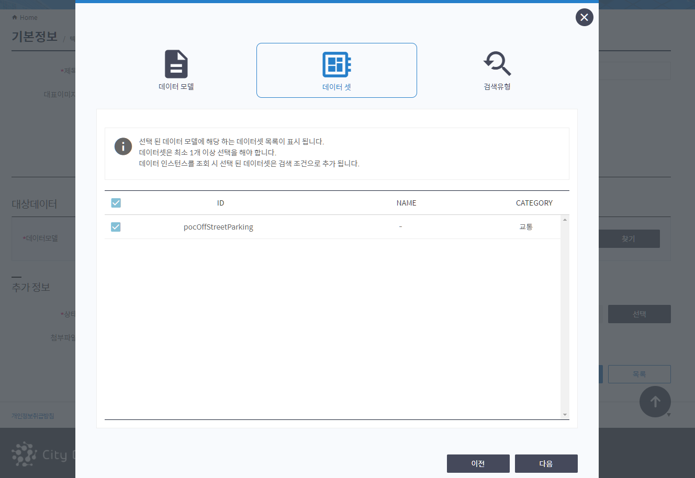

 

 

마지막 세번째 단계입니다.

제공유형은 2가지로 구분됩니다.

인스턴스형은 앞 단계에 선택 된 데이터셋의 인스턴스가 기 정의 되어 있습니다.

해당 인스턴스로 들어오는 데이터들은 모두 제공 대상이 됩니다.

 

다음으로는 필터형입니다. 

제공 대상이 인스턴스 내 데이터가 아니라,

들어오는 데이터에 조건을 주어, 조건에 부합되는 데이터만 제공 대상이 됩니다.

 

제공하는 목적에 따라서 2가지 유형중 1개를 선택 한 뒤 선택 버튼을 클릭 하여 최종 선택을 합니다. 

 

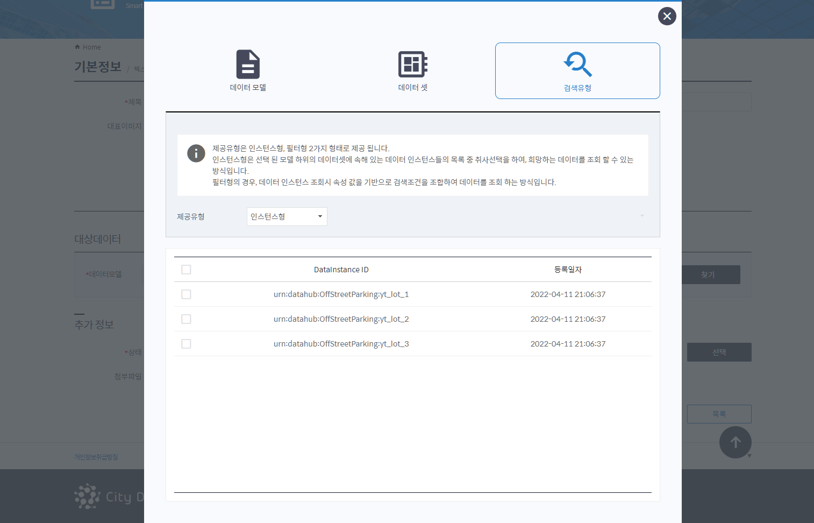

 

 

대상 데이터 정보가 표시됩니다.

이제 데이터셋 기본 정보를 입력 해야 하는데, 직접 입력을 해도 되고, 기본 정보 불러오기 버튼을 통해 위에 선택 된 데이터모델에 기 정의 된 기본 정보를 불러와 자동 설정을 할 수 있습니다.

 

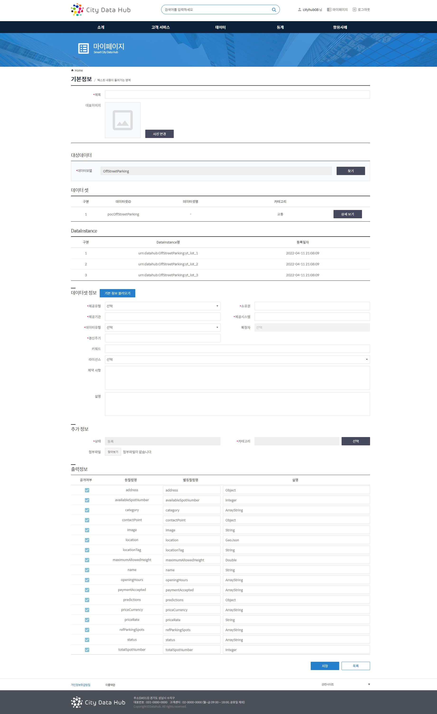

 

 

데이터셋 목록 화면또는 데이터셋 상세 화면에서의 이용신청 팝업 화면입니다.

사용자는 제공 받고 싶은 데이터셋을 이용신청 하여 데이터를 구독할 수 있습니다.

무료/유료 로 구분되어 있으며, 무료인 경우 간단하게 정보입력후 이용신청을 할 수 있지만,

유료인 경우에는 데이터셋의 가격정책에 따라 책정 되어 진 가격을 결재 한 뒤 이용 신청 진행 할 수 있습니다.

 

데이터를 제공 받을 수 있는 방법은 크게 2가지 형태입니다.

사용자가 직접 데이터셋의 Endpoint API 로 요청하여 원하는 조건으로 데이터를 조회 해 가는 방법.

실시간으로 데이터를 받고자 할 경우 실시간 수신 신청을 하여 수신 받는 서버 주고를 등록 하는 방법입니다. 

아래는 2가지에 대한 화면입니다.

 

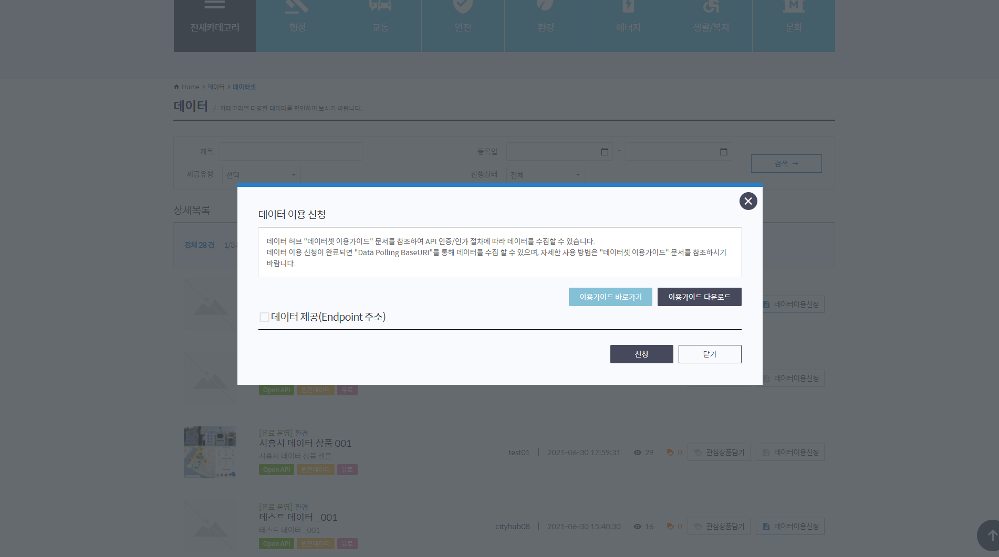

 

 

실시간 수신 방식은 3가지 프로토콜을 지원합니다.

* HTTP
* Websocket
* MQTT

 

HTTP 인 경우 사용자의 수신 서버가 존재 해야 하며, 수신받을 URL을 입력 해야 합니다.

Websocket, MQTT 인 경우 접속 주소를 안내 받아 직접 연결을 맺어, 데이터를 받아야 합니다.

 

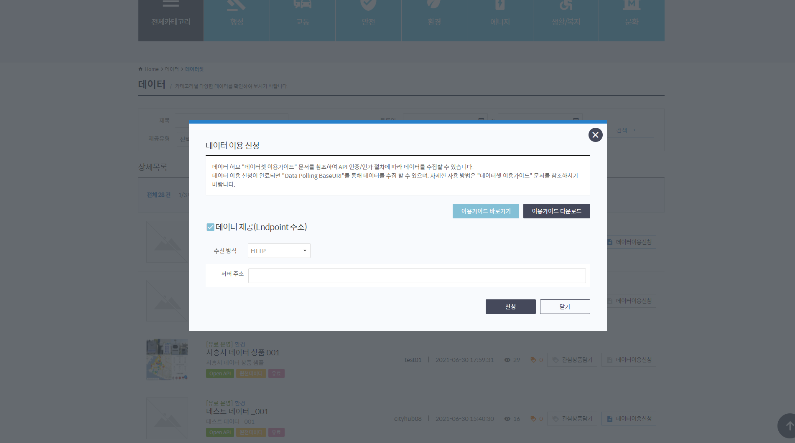

 

 

유료 대상의 데이터셋 이용 신청 화면입니다.

제공자가 책정 한 데이터셋의 가격 정책 정보가 표시 하며,  원하는 결제 정보 항목을 선택 한 뒤,

기간을 지정하고 신청하면 결제가 진행 됩니다.

 

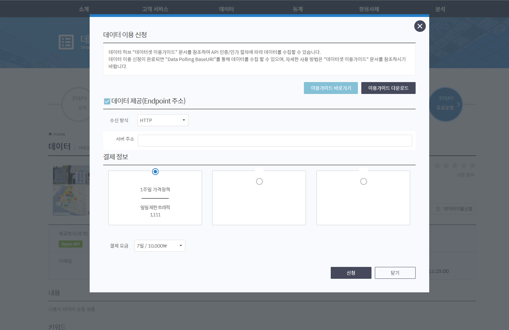

 

 

사용자는 데이터셋의 만족도를 평가 할 수 있습니다.

데이터셋 상세화면의 상단에 별점 별아이콘을 선택 하여 입력을 할 수 있습니다.

 

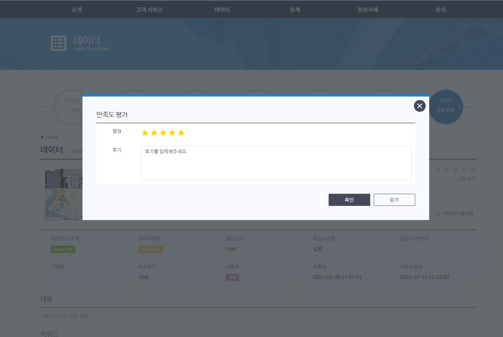
