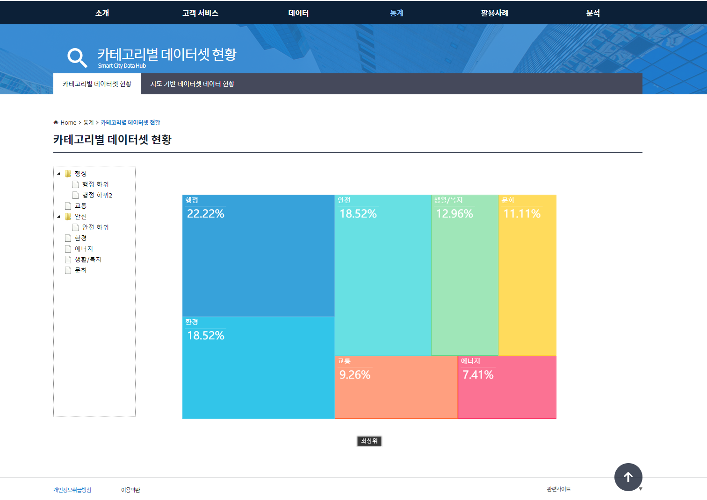
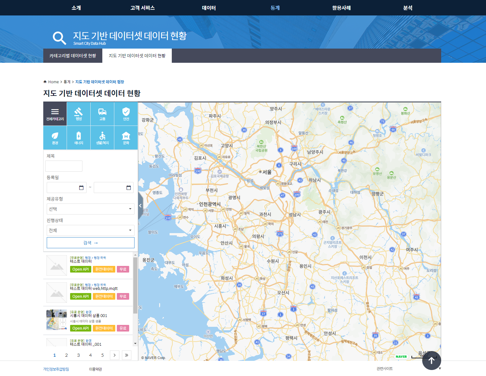

# 5.통계

통계는 다음과 같은 하위 메뉴를 포함 합니다.

* 카테고리별 데이터셋 현황
* 지도 기반 데이터셋 데이터 현황

------

 

 

정의 된 카테고리별 데이터셋 현황 정보를 표시 합니다.

하위 카테고리가 존재 할 경우에는 그래프 영역을 선택하여 하위 레벨로 전환 할 수 있고,

하위 카테고리가 존재 하지 않을 경우에는 선택 된 카테고리에 해당 하는 데이터셋 목록 화면으로 이동 됩니다.

 

 

데이터셋에 연결 된 데이터모델의 좌표 정보를 기준으로 데이터 현황 정보를 표시 합니다.

 

