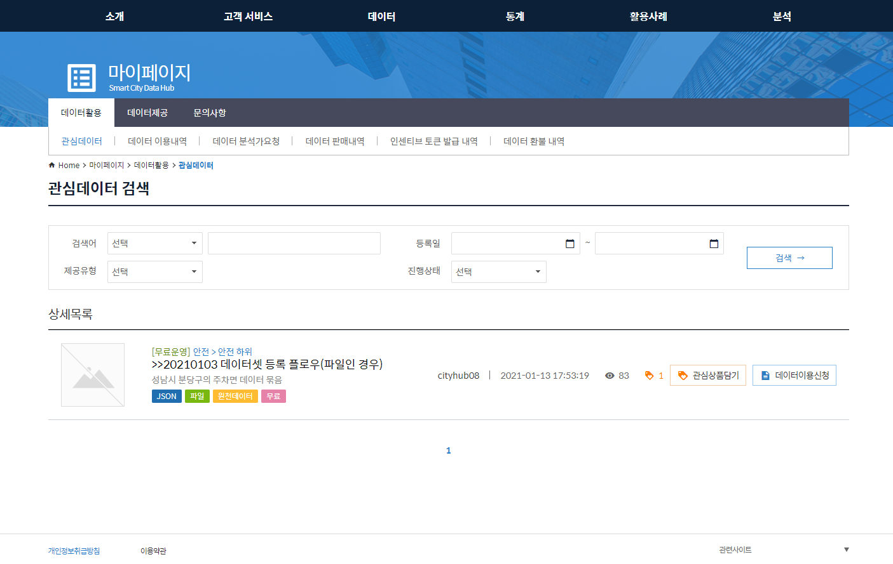

# 7.마이페이지

마이페이지는 다음과 같은 하위 메뉴를 포함 합니다.

* 데이터활용
* 데이터제공

 

데이터 활용은 데이터셋을 이용하는 이용자 기준 메뉴 구성입니다.

데이터 제공은 데이터셋을 제공하는 제공자 기준 메뉴 구성입니다.

 

현재 로그인 한 사용자의 역활에 따라 메뉴를 선택하여 사용 해야 합니다.

------

### 7.1. 데이터활용

데이터 활용하는 이용자 전용 메뉴입니다.

 

#### 7.1.1. 관심데이터

데이터셋의 관심상품담기를 선택 한 관심 데이터셋 목록 정보입니다.

 

 

#### 7.1.2. 데이터 이용내역

데이터셋의 데이터이용신청을 한 데이터셋 목록 정보로, 현재 이용중인 대상 데이터셋입니다.

 

 

 

이용신청을 한 데이터셋중 유료인 경우에는, 구매내역보기에 대한 상세 정보가 별도로 표시 됩니다.

 

 

 

위의 유료 데이터셋을 이용신청 중에 환불을 희망 할 경우, 환불신청하여 구독을 취소 할 수도 있습니다.

 

 

#### 7.1.3. 데이터 분석가요청

대메뉴인 ***<u>[분석]</u>***  버튼을 선택 하게 되면 분석 페이지로 전환됩니다.

이때 분석을 할 대상 데이터 모델을 선택하게 되는데,

아래 데이터 분석가요청 메뉴를 통해 등록 할 수 있습니다.

등록 된 데이터 분석가요청 정보는 승인처리 담당자로부터 승인을 받아야만 최종 분석 대상이 됩니다.

 

 

 

분석 대상의 모델을 선택 합니다.

 

#### 7.1.4. 데이터 판매내역

현재 화면이 준비 되어 있지 않습니다.

 

 

#### 7.1.5. 인센티브 토큰 발급 내역

데이터셋의 만족도 평가 신청 할 경우 인센티브 토큰이 발행 됩니다.

발행 되는 토큰 내역이 표시 됩니다.

 

 

 

#### 7.1.6. 데이터 환불 내역

유료 데이터셋을 결제 하고 나서 환불 신청을 한 내역에 대해 표시 됩니다.

------

### 7.2. 데이터제공

데이터 제공하는 제공자 전용 메뉴입니다.

 

#### 7.2.1. 데이터관리

내가 등록 한 데이터셋 정보가 표시 됩니다.

대메뉴인 ***<u>[데이터]</u>*** 는  데이터셋을 등록 한 다음에 승인을 받아야만 사용자들에게 공개가 됩니다.

이 곳에는 최초 등록 상태의 데이터셋 정보를 포함 한 내가 등록 한 모든 데이터셋이 표시 됩니다.

 

 

#### 7.2.2. 데이터 사용자현황

데이터셋 사용자 현황 통계 정보를 표시 합니다.

 

####  

 

#### 7.2.3. 어댑터 신청 내역

 

 

 

 

#### 7.2.4. 데이터 환불 내역

사용자가 요청 한 환불 내역 정보를 표시합니다.

제공자는 환불 요청 건에 대해 최종 승인을 하여, 환불을 진행합니다.

